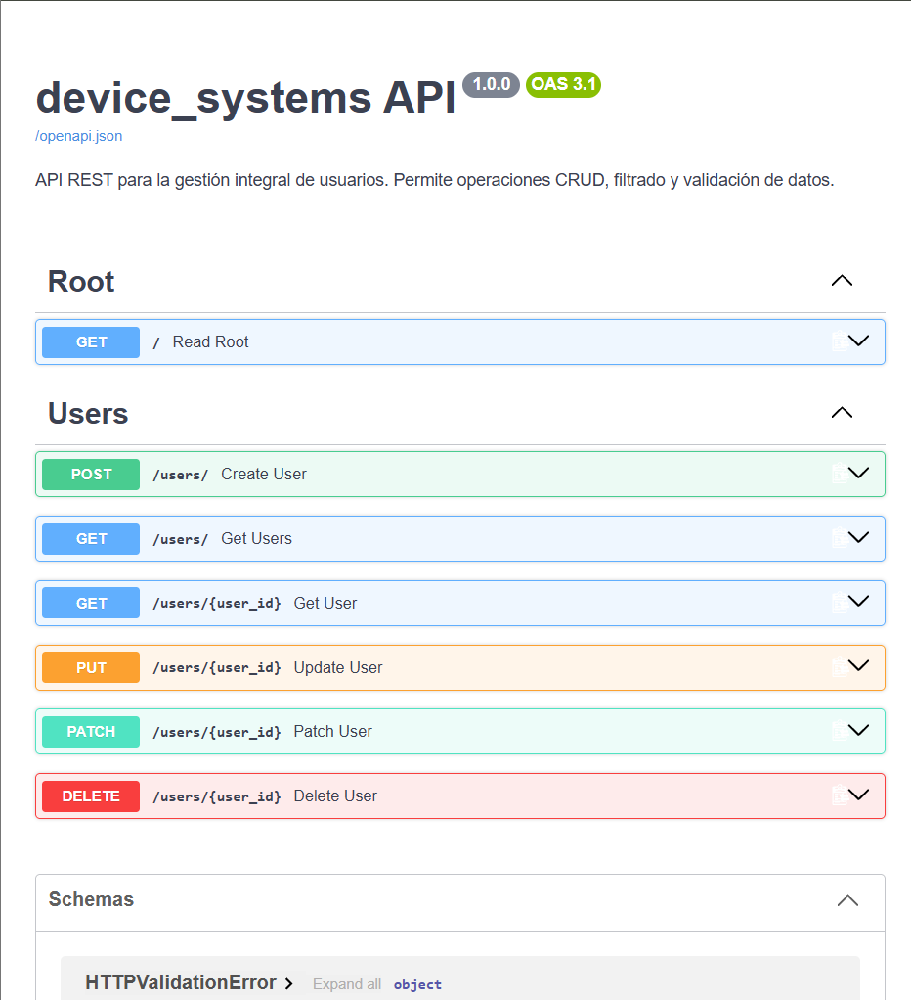
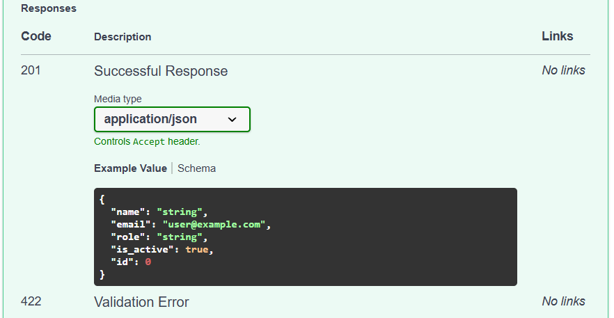
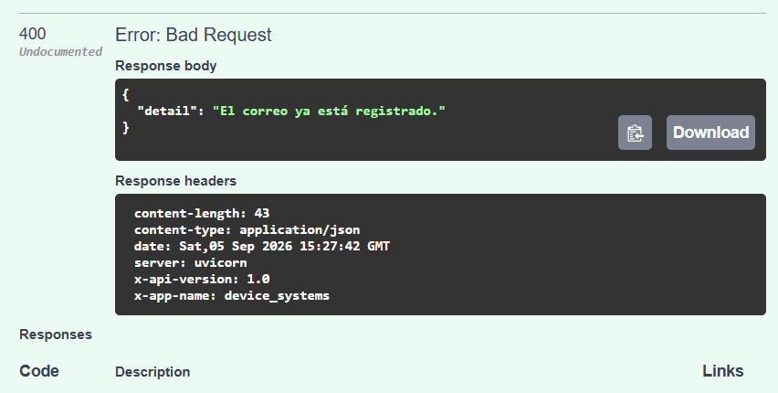

# device_systems

API REST desarrollada con **FastAPI** para la gestión del recurso **usuarios**
dentro del sistema `device_systems`.

Proyecto realizado para la actividad **GA1-220501096-01-AA1-EV07 – Fundamentos
de FastAPI: API REST para Gestión de Usuarios** (SENA, ADSO).

## Descripción de la aplicación

`device_systems` expone un API REST que permite:

- Listar usuarios, con filtros opcionales por `role` y `is_active`.
- Consultar un usuario puntual mediante su `id` (path parameter).
- Registrar nuevos usuarios (POST), validando los datos con **Pydantic v2** y evitando correos duplicados.
- Actualizar de forma completa (PUT) o parcial (PATCH) los datos de un usuario existente.
- Eliminar usuarios del sistema (DELETE).
- Retornar respuestas estandarizadas mediante `response_model`, ocultando cualquier dato interno que no deba exponerse.
- Enviar cabeceras HTTP personalizadas en cada respuesta:
  - `X-App-Name: device_systems`
  - `X-API-Version: 1.0`

## Estructura del proyecto

```text
device_systems/
├── app/
│   ├── main.py
│   ├── schemas/
│   │   └── user_schema.py
│   ├── routes/
│   │   └── user_routes.py
├── requirements.txt
└── README.md
```

## Modelo de usuario

| Campo       | Tipo    | Validación                                   |
|-------------|---------|-----------------------------------------------|
| `id`        | int     | Autogenerado por el servidor                  |
| `name`      | str     | Obligatorio, mínimo 3 caracteres               |
| `email`     | EmailStr| Formato de correo válido y único               |
| `role`      | enum    | `admin`, `support` o `user`                    |
| `is_active` | bool    | `true` o `false`                               |

## Instalación de dependencias

1. Clonar el repositorio y ubicarse en la carpeta del proyecto:

   ```bash
   git clone <URL_DEL_REPOSITORIO>
   cd device_systems
   ```

2. Crear y activar un entorno virtual (opcional pero recomendado):

   ```bash
   python -m venv .venv
   # Windows
   .venv\Scripts\activate
   # Linux / macOS
   source .venv/bin/activate
   ```

3. Instalar las dependencias:

   ```bash
   pip install -r requirements.txt
   ```

## Ejecución del servidor

Desde la raíz del proyecto (`device_systems/`):

```bash
uvicorn app.main:app --reload
```

La API quedará disponible en `http://127.0.0.1:8000` y la documentación interactiva (Swagger UI) en `http://127.0.0.1:8000/docs`.

## Tabla de endpoints

| Método | Endpoint               | Descripción                                     |
|--------|------------------------|-------------------------------------------------|
| GET    | `/`                    | Verifica el estado del servicio                 |
| GET    | `/users`               | Lista todos los usuarios                        |
| GET    | `/users?role=admin`    | Filtra usuarios por rol                         |
| GET    | `/users?is_active=true`| Filtra usuarios por estado activo/inactivo      |
| GET    | `/users/{user_id}`     | Consulta un usuario por su ID                   |
| POST   | `/users`               | Registra un nuevo usuario                       |
| PUT    | `/users/{user_id}`     | Actualiza completamente un usuario existente    |
| PATCH  | `/users/{user_id}`     | Actualiza parcialmente los datos de un usuario  |
| DELETE | `/users/{user_id}`     | Elimina un usuario del sistema                  |

## Ejemplos de peticiones

### GET /users

```bash
curl -X GET "http://127.0.0.1:8000/users"
```

Respuesta:

```json
[
  {
    "id": 1,
    "name": "Juan Mejía",
    "email": "juan.mejia@example.com",
    "role": "admin",
    "is_active": true
  }
]
```

### GET /users/{user_id}

```bash
curl -X GET "http://127.0.0.1:8000/users/1"
```

### GET /users?role=admin&is_active=true

```bash
curl -X GET "http://127.0.0.1:8000/users?role=admin&is_active=true"
```

### POST /users

```bash
curl -X POST "http://127.0.0.1:8000/users"   -H "Content-Type: application/json"   -d '{
        "name": "María Torres",
        "email": "maria.torres@example.com",
        "role": "user",
        "is_active": true
      }'
```

Respuesta (`201 Created`):

```json
{
  "id": 4,
  "name": "María Torres",
  "email": "maria.torres@example.com",
  "role": "user",
  "is_active": true
}
```

### PUT /users/{user_id} (Actualización completa)

```bash
curl -X PUT "http://127.0.0.1:8000/users/1"   -H "Content-Type: application/json"   -d '{
        "name": "Juan Diego",
        "email": "juan.diego@example.com",
        "role": "admin",
        "is_active": true
      }'
```

### PATCH /users/{user_id} (Actualización parcial)

```bash
curl -X PATCH "http://127.0.0.1:8000/users/1"   -H "Content-Type: application/json"   -d '{
        "is_active": false
      }'
```

### DELETE /users/{user_id}

```bash
curl -X DELETE "http://127.0.0.1:8000/users/1"
```
*(Respuesta: `204 No Content` - Sin cuerpo de respuesta)*

### Error por correo duplicado (`400 Bad Request`)

```bash
curl -X POST "http://127.0.0.1:8000/users"   -H "Content-Type: application/json"   -d '{
        "name": "Otro Usuario",
        "email": "maria.torres@example.com",
        "role": "user",
        "is_active": true
      }'
```

```json
{
  "detail": "Ya existe un usuario registrado con el correo maria.torres@example.com."
}
```

## Códigos de estado usados

- **200 OK:** Petición procesada correctamente (GET, PUT, PATCH).
- **201 Created:** Usuario creado de forma exitosa (POST).
- **204 No Content:** Usuario eliminado correctamente (DELETE).
- **400 Bad Request:** Error del cliente (ej. correo duplicado, envío de datos inválidos o PATCH vacío).
- **404 Not Found:** Recurso no encontrado (ej. intentar consultar, actualizar o eliminar un ID inexistente).
- **422 Unprocessable Entity:** Error arrojado por Pydantic al fallar las validaciones de esquema (ej. `name` con menos de 3 caracteres).

## Explicación breve del uso de Depends()

En esta API, `Depends()` se utiliza para implementar la **Inyección de Dependencias (Dependency Injection)**. Esto permite inyectar dependencias (como la conexión a una base de datos o listas simuladas en memoria) directamente en las funciones de las rutas (`path operations`). Esto facilita la reutilización de código, centraliza la lógica de acceso a datos y simplifica la creación de pruebas unitarias (testing) al permitir reemplazar fácilmente la base de datos real por una de prueba.

## Explicación del manejo de errores implementado

El manejo de errores se gestiona utilizando la clase `HTTPException` de FastAPI. Esto permite interceptar flujos incorrectos y devolver respuestas HTTP claras.
- **Validaciones de negocio (400):** Se valida de forma manual que no se puedan crear o actualizar usuarios con un correo electrónico que ya pertenezca a otra cuenta. También se controla que no se envíen peticiones PATCH vacías.
- **Validación de existencia (404):** Antes de ejecutar operaciones `GET`, `PUT`, `PATCH` o `DELETE` sobre un ID específico, el sistema verifica que el registro exista; de lo contrario, detiene el proceso inmediatamente devolviendo un error de recurso no encontrado.

## Capturas de Swagger UI

## 📸 Evidencias de Ejecución y Pruebas (Swagger UI)

A continuación se muestran las capturas de pantalla que validan el correcto funcionamiento de la API (`device_systems`), abarcando la vista general, respuestas exitosas y el manejo de errores:

### 1. Vista General de la API


### 2. Respuesta Exitosa (Creación de Usuario - 201 Created)


### 3. Manejo de Errores (Correo Duplicado - 400 Bad Request)


## Reflexión sobre el uso de FastAPI

FastAPI permite construir APIs REST de forma rápida y segura gracias a su
integración nativa con Pydantic para la validación de datos, la generación
automática de documentación interactiva (Swagger UI) y el manejo declarativo
de path/query parameters. En este proyecto se aplicaron modelos de entrada y
salida separados (`UserCreate` / `UserResponse`) para controlar exactamente
qué información se expone al cliente, además de cabeceras HTTP personalizadas
y manejo de errores mediante `HTTPException`.
